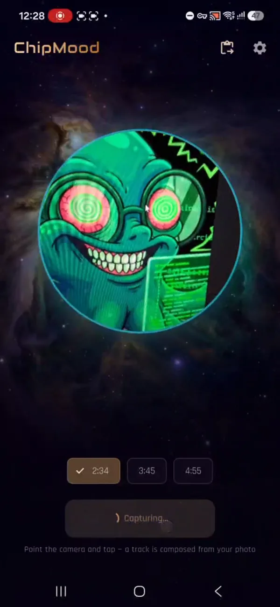

<h1 align="center">ChipMood</h1>

<p align="center">
  Превращает фото в оригинальный <b>16-битный chiptune</b> — сочиняет и синтезирует прямо на телефоне.<br/>
  Навёл камеру, нажал один раз — приложение читает настроение по цветам и пишет целую песню. Полностью офлайн.
</p>

<p align="center">
  <b>Русский</b> ·
  <a href="README.en.md">English</a>
</p>

<p align="center">
  
  
  
  
</p>

<p align="center">
  
  &nbsp;&nbsp;
  
</p>

<p align="center"><sub>снял фото — получил трек · <a href="https://github.com/alex90132/chipmood/raw/main/docs/demo.mp4">видео со звуком</a></sub></p>

## Что умеет

ChipMood — эксперимент по генерации музыки на устройстве по фотографии. Наводишь
камеру на что угодно, жмёшь один раз — и приложение определяет настроение по
цветам снимка, сочиняет целый трек из библиотеки реальных игровых музыкальных
фраз и играет его на собственном чип-синтезаторе (импульс / треугольник / пила /
шум). Цель — чтобы звучало так, **будто написал и сыграл живой человек**, но с
сырой «чиповой душой» классического chiptune.

- **Фото → музыка одним нажатием** — лёгкий анализ цвета (яркость, теплота,
  насыщенность) задаёт настроение: happy / tense / sad / calm.
- **Только хиты** — каждое нажатие генерирует кучу вариантов трека, встроенный
  «критик» оценивает каждый и играет **только лучший**; неудачные ты не слышишь.
- **Полностью офлайн** — без облака, аккаунта и кредитов; весь звук даёт
  собственный синтезатор на Rust, а не сэмплы.
- **Ремикс через любой ИИ-чат** — кнопка **Copy** собирает компактный промпт с
  реальными «хит-фразами», вставляешь ответ обратно кнопкой **Paste** — трек
  аранжируется и синтезируется на устройстве.
- **Живой микшер и экспорт** — мьют каналов на лету под эквалайзером, экспорт в
  MP3 320 kbps с фото-обложкой внутри файла.

## Как это работает

1. **Фото → настроение.** Анализ цвета через `dart:ui` раскладывает снимок по
   квадранту valence/arousal.
2. **Поиск (RAG).** Библиотека реальных, нормализованных по тональности
   «кирпичиков» запрашивается по настроению — фразы (лид / гармония / контрапункт
   / бас / барабаны), аккорды, формы, грувы, бас-линии, сбивки, голосования.
3. **Сочинение (`RagComposer`).** Полностью на устройстве: выбирает связный
   материал, транспонирует в тональность и выстраивает сквозную форму
   (вступление → развитие → брейкдаун → поднятый финальный припев → концовка).
   *Опционально:* со своим ключом OpenRouter план пишет LLM по той же библиотеке.
4. **Аранжировка (`ProceduralArranger` + `MelodyEngine`).** Компактный план
   превращается в плотную 8-голосную `Composition` с «человеческой» агогикой.
5. **Выбор лучшего дубля (`HitCritic`).** Символьный критик оценивает кандидатов
   по повторяемости хука, поющемуся контуру, консонансу лида и баса,
   устойчивости грува, «дыханию» фраз и динамике припева — играется победитель.
6. **Синтез (движок на Rust).** Band-limited осцилляторы (PolyBLEP), синтез
   барабанов, резонансный фильтр на голос, драйв, бит-краш, тремоло, по-нотные
   трекерные эффекты (арп / слайд / вибрато / ретриг / дилей).
7. **Мастеринг + вывод.** Glue-компрессор → левелер → лимитер и лёгкий реверб;
   воспроизведение как 16-bit PCM, экспорт в MP3 с обложкой.

## Датасеты в основе библиотеки

Намайнены скриптами в `ml/` в компактный JSON в `assets/rag/`:

- **NES-MDB** + General-MIDI (мульти-трек) — chiptune и широкая мелодика.
- **POP909** — реальные поп-прогрессии аккордов + контрапункт.
- **EMOPIA** — фортепианные клипы с точными метками настроения (4 квадранта).
- **VGMIDI** — аранжировки игровых саундтреков.
- **YM2413-MDB** — FM игровая музыка 80-х с эмо-метками.
- Трекерные модули **Unreal / UT99** — сквозные формы и демосцен-лиды (свой
  парсер S3M/IT; не распространяются).

## Нейросетевой эксперимент (честно)

Сначала попробовали **обучить нейросеть** сочинять chiptune целиком (`ml/train.py`,
`ml/model.py`, `ml/generate.py`, чек-пойнт `ckpt.pt`). Вышло **плохо** —
бессвязный, бесструктурный вывод. Для вменяемой модели символьной музыки нужно
несравнимо больше данных, вычислений и времени. Поэтому перешли к
**retrieval-augmented + правила** — звучит несравнимо лучше. Нейропуть остался в
коде опционально, но не по умолчанию.

## Собрать самому

Нужны: Flutter SDK, тулчейн Rust (`rustup`) и Android NDK. Rust-крейт собирается
автоматически хуками `flutter_rust_bridge`.

```bash
flutter pub get
flutter run                      # на подключённом устройстве
flutter build apk --release      # релизный APK
flutter test                                       # Dart-тесты
cargo test --lib --manifest-path rust/Cargo.toml   # тесты движка
```

> LLM-композитор опционален: введи свой ключ OpenRouter в **Настройках** (в
> приложении ключа нет) или `flutter build apk --dart-define=OPENROUTER_API_KEY=...`.

## Данные и авторские права

Звук ChipMood идёт от собственного синтезатора, а не от сэмплов. Библиотека
референсов содержит только нормализованные, преобразованные ноты. Защищённый
авторским правом исходный материал (модули Unreal/UT99, сырые датасеты,
чек-пойнты) **не** включён и в `.gitignore` — для перезапуска майнеров принеси
свои копии.

## Благодарности

ChipMood стоит на работе многих людей — спасибо:

- **Марковская модель мелодии** — цепь Маркова 2-го порядка по ступеням лада
  адаптирована из
  [oscarsandford/chiptune-generation](https://github.com/oscarsandford/chiptune-generation).
- **Настроение из музыки** — отображение valence/arousal вдохновлено
  [serkansulun/midi-emotion](https://github.com/serkansulun/midi-emotion).
- **Orpheus Music Transformer** Александра Сигалова — опциональный путь
  дообучения в `ml/orpheus/` построен на
  [asigalov61/Orpheus-Music-Transformer](https://huggingface.co/asigalov61/Orpheus-Music-Transformer)
  (Apache-2.0).
- **Датасеты**: [NES-MDB](https://github.com/chrisdonahue/nesmdb),
  [POP909](https://github.com/music-x-lab/POP909-Dataset),
  [EMOPIA](https://annahung31.github.io/EMOPIA/),
  [VGMIDI](https://github.com/lucasnfe/vgmidi),
  [YM2413-MDB](https://zenodo.org/records/7520537).
- Саундтрек **Unreal / UT99** использован только для изучения и не
  распространяется.

## Лицензия

Public domain — **The Unlicense** (см. [`LICENSE`](LICENSE)). Делай что угодно.
Сторонние датасеты, использованные для генерации данных, имеют свои условия.
