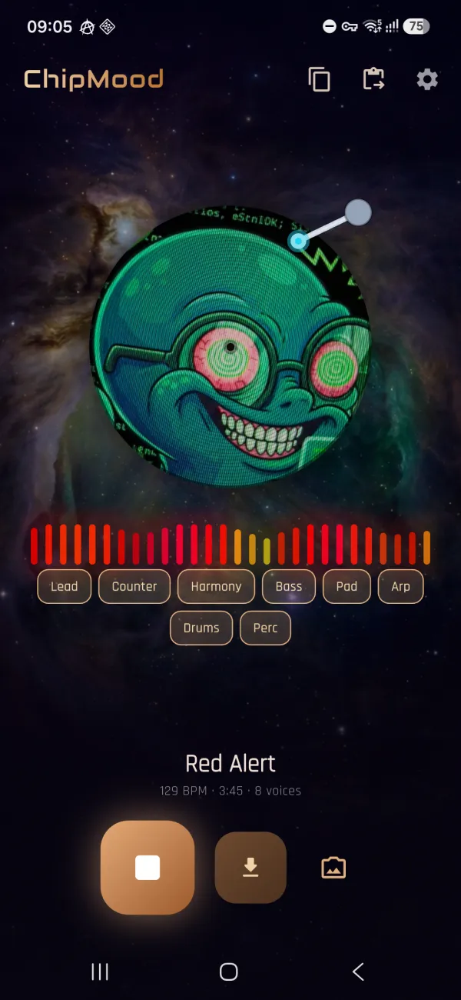

# ChipMood

*A research / experimental project*

**English** · [Русский](README.ru.md)

Turn a photo into an original 16‑bit chiptune track — composed and synthesized
entirely on your device.

<p align="center">
  
  &nbsp;&nbsp;
  <a href="https://github.com/alex90132/chipmood/raw/main/docs/demo.mp4">
    
  </a>
</p>

<p align="center"><sub>screenshot · animated demo (click for the full video with sound)</sub></p>

---

## What it is

ChipMood is an experiment in **on‑device, photo‑driven music generation**. Point
the camera at anything, tap once, and the app reads a mood from the image's
colours, composes a full song from a library of real game‑music phrases, and
plays it back on a hand‑written chip synthesizer (pulse / triangle / saw /
noise). It runs **fully offline** by default — no cloud, no account, no credits.

## The goal (and where it stands)

The north star is a track that sounds like **a human actually wrote and played
it** — real structure, a singable melody, tasteful harmony, groove and
dynamics — while keeping the raw, on‑chip "soul" of classic chiptune. This is an
ongoing research project: it gets closer with every iteration, but it is not a
finished product.

## The neural experiment (honest results)

We first tried the obvious thing: **train a neural model** to compose chiptune
end‑to‑end (see `ml/train.py`, `ml/model.py`, `ml/generate.py`, the `ckpt.pt`
checkpoint and the `server.py` inference path). The result was **poor** —
meandering, structureless output that never felt musical. Training a competent
symbolic‑music model needs far more data, compute and time than the project had.

So we pivoted to a **retrieval‑augmented, rules‑driven** approach that leans on
real music instead of a half‑trained model — and it sounds dramatically better.
The neural path is still wired in (optional, behind a settings URL) but is not
the default.

## How it works (pipeline)

1. **Photo → mood.** A small `dart:ui` colour analysis (brightness, warmth,
   saturation) maps the shot to a valence/arousal quadrant: happy / tense /
   sad / calm.
2. **Retrieval (RAG).** A library of real, key‑normalized musical material is
   queried by mood — exemplar phrases (lead / harmony / counter / bass / drums),
   chord progressions, song forms, grooves, basslines, fills and chord voicings.
3. **Compose (`RagComposer`).** Entirely on‑device, it picks coherent material,
   transposes it to a key, lays out a through‑composed form (intro → developing
   body → breakdown → lifted final chorus → outro) and mixes parts from the
   retrieval pool. No network, no AI credits.
   - *Optional LLM path:* with your own OpenRouter API key, an LLM writes the
     song plan instead, guided by the same reference library.
4. **Arrange (`ProceduralArranger` + `MelodyEngine`).** The compact plan becomes
   a dense 8‑voice `Composition`: arpeggiated harmony, walking bass, drum groove
   + fills, per‑section energy curve and humanized timing/velocity.
5. **Pick the best take (`HitCritic`).** Each tap generates many candidate
   tracks; a symbolic critic scores every one for hook/motif repetition,
   singable contour, lead‑vs‑bass consonance, groove steadiness, breathing and
   chorus dynamics — and only the winner is ever played. The duds are discarded
   unheard, so the floor quality rises.
6. **Synthesize (Rust engine).** A hand‑written engine renders it: band‑limited
   oscillators (PolyBLEP), drum synthesis (kick/snare/hat/tom), per‑voice
   resonant filter, drive, bitcrush, tremolo, per‑note tracker effects (arp /
   slide / vibrato / retrigger / delay) and a tempo‑synced ping‑pong delay.
7. **Master.** A glue compressor → long‑term leveler → brick‑wall limiter bus,
   plus a small reverb, keep levels even and the mix cohesive.
8. **Playback & export.** Audio streams as 16‑bit PCM via `flutter_pcm_sound`
   for live playback; export renders a 320 kbps MP3 with the source photo
   embedded as cover art. A **live mixer** (mute buttons per channel under the
   equalizer) lets you tweak the mix, and the choice carries into the export.

## Remix with any AI chat

The **Copy** button builds a compact, human‑readable prompt (craft rules + real
"hit phrases" mined from the reference library + a skeleton of the current
track). Paste it into any AI chat, get a modified song plan back, paste it into
the app with **Paste**, and it is arranged and synthesized on‑device — no API
key required.

## Datasets behind the retrieval library

Mined by the scripts in `ml/` into compact JSON in `assets/rag/`:

- **NES‑MDB** + a General‑MIDI multi‑track set — chiptune & broad melodic vocab.
- **POP909** — real pop chord progressions + secondary (counter) melodies.
- **EMOPIA** — piano clips with precise 4‑quadrant valence/arousal mood labels.
- **VGMIDI** — video‑game soundtrack arrangements.
- **YM2413‑MDB** — 80s FM video‑game music with emotion labels (mined locally).
- **Unreal / UT99** tracker modules — through‑composed forms & demoscene leads
  (parsed by our own S3M/IT reader; not redistributed).

## Architecture

```
lib/src/
  domain/         entities (Composition, Pattern, Note, Instrument…)
  data/
    composer/     RagComposer — builds the whole song plan offline from RAG
    arranger/     ProceduralArranger + MelodyEngine — plan → dense Composition
    critic/       HitCritic — scores candidates so only the best take plays
    datasources/  OpenRouter (LLM) + Rust synth bridge + PCM player
    knowledge/    NesRag, GrooveLibrary — load the retrieval library
    mappers/      Composition <-> tracker‑style JSON contract
  presentation/   Riverpod providers, controllers, screens, widgets
rust/src/synth/   the synthesis engine (oscillators, drums, FX, mastering)
rust/src/api/     flutter_rust_bridge surface (stream / WAV / MP3)
ml/               offline data‑mining + the (abandoned) neural experiment
assets/rag/       the retrieval library (normalized note data, JSON)
```

## Build & run

Requirements: Flutter SDK, the Rust toolchain (`rustup`) and the Android NDK.
The Rust crate is built automatically by the `flutter_rust_bridge` hooks.

```bash
flutter pub get
flutter run                      # on a connected device
flutter build apk --release      # release APK
flutter test                                       # Dart tests
cargo test --lib --manifest-path rust/Cargo.toml   # Rust engine tests
```

Optional LLM composer: paste your own OpenRouter key in **Settings** (none ships
with the app), or `flutter build apk --dart-define=OPENROUTER_API_KEY=sk-or-...`.

## Data & copyright

ChipMood's sound comes from a hand‑written synthesizer, not from samples. The
retrieval library contains only normalized, transformed note data. Copyrighted
source material (the Unreal/UT99 modules, raw datasets, checkpoints) is **not**
included and is git‑ignored — bring your own copies to re‑run the miners.

## Acknowledgements

ChipMood stands on a lot of other people's work — thank you:

- **Markov melody model** — the order‑2 scale‑degree Markov chain that drives a
  lot of the lead lines is adapted from Oscar Sandford's
  [chiptune-generation](https://github.com/oscarsandford/chiptune-generation).
- **Mood from music** — the continuous valence/arousal mapping was inspired by
  [serkansulun/midi-emotion](https://github.com/serkansulun/midi-emotion).
- **Orpheus Music Transformer** by Aleksandr Sigalov — the optional fine‑tuning
  path under `ml/orpheus/` builds on
  [asigalov61/Orpheus-Music-Transformer](https://huggingface.co/asigalov61/Orpheus-Music-Transformer)
  (Apache‑2.0).
- **Datasets** mined into the retrieval / Markov library:
  [NES‑MDB](https://github.com/chrisdonahue/nesmdb),
  [POP909](https://github.com/music-x-lab/POP909-Dataset),
  [EMOPIA](https://annahung31.github.io/EMOPIA/),
  [VGMIDI](https://github.com/lucasnfe/vgmidi),
  [YM2413‑MDB](https://zenodo.org/records/7520537).
- The **Unreal / UT99** soundtrack is referenced for study only and is not
  redistributed.

Each project keeps its own license; only normalized note data derived from them
ships in this repo.

## License

Public domain — **The Unlicense** (see `LICENSE`). Do whatever you want with it.
Third‑party datasets used to generate the bundled data carry their own terms.
